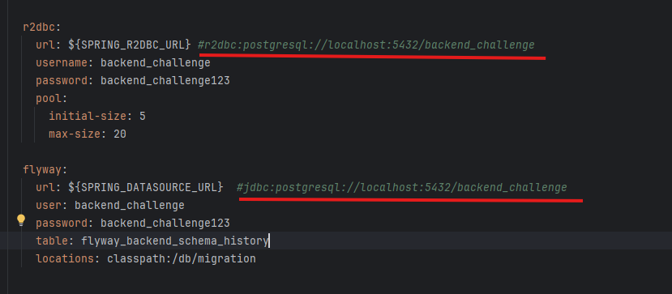

# **Tenpo challenge**
# Descripción
El siguiente proyecto se realizó con varios paradigmas como la reactividad para agilizar la concurrencia y la sincronización,
programación funcional para mejorar la legibilidad y programación orientada a aspectos para realizar el registro de todos los llamados a los endpoints (esto se hace asincronamente atraves de un aspecto).
Para el despliegue, solo se debe compilar el archivo docker-compose.
En el endpoint calculatePercentage se utiliza una clase llamada Provider que tendrá un 60% de probabilidad de fallar, simulando un servicio externo (sería un mock que retorna el 50%).
Para el caché se usa la librería Caffeine, compatible con componentes reactivos.
Por cuestión de tiempo no se adjuntaron los tests unitarios, pero la tecnología a utilizar sería Mockito con JUnit.
Un aspecto a mejorar es que actualmente no se está utilizando un sistema de paginación para el histórico.

#  Coleccion de postman 🛰️
[BACKEND-CHALLENGE.postman_collection.json](BACKEND-CHALLENGE.postman_collection.json)

#  Tecnologías usadas 🛠️
* Spring AOP
* Spring Webflux
* Spring Boot
* Java 21 
* R2DBC
* Caffeine (cache)
* Postgres


#  Configuración y despliegue 🐋

### Docker
comando para subir el docker compose este levantara la aplicacion y la base de datos 

```sh
docker docker-compose up --build
```
### Local

Para desplegarlo localmente, debes descomentar las variables del application.yml:


## Empoints 

### Cálculo de números
http://localhost:8081/api/backend/calculate-percentage/100/50

### Recuperar todo el histórico
http://localhost:8081/api/backend/calculate-percentage/{num1}/{num2}

### Obtener llave del caché
http://localhost:8080/public/swagger-ui/index.html


## Guías

* [Official Apache Maven documentation](https://maven.apache.org/guides/index.html)
* [Spring Boot Maven Plugin Reference Guide](https://docs.spring.io/spring-boot/3.4.4/maven-plugin)
* [Spring Reactive Web](https://docs.spring.io/spring-boot/3.4.4/reference/web/reactive.html)
* [Spring Data R2DBC](https://docs.spring.io/spring-boot/3.4.4/reference/data/sql.html#data.sql.r2dbc)


#### link del repo : 